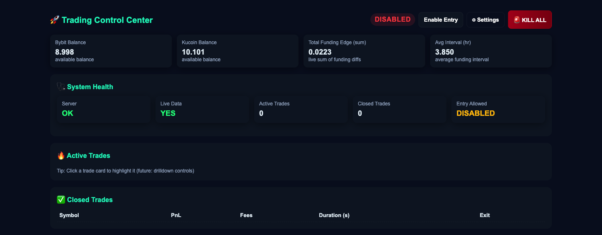
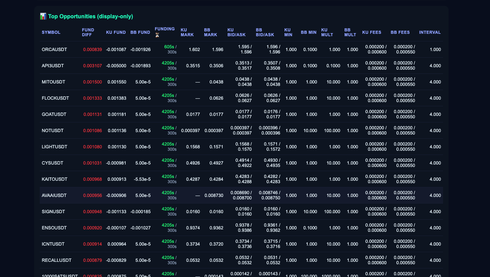

# Real-Time-crypto-Arbitage-Engine 
# https://github.com/Rahulmaurya1234/Real-Time-crypto-Arbitage-Engine/tree/main

A full stack algorithmic trading system that performs cross-exchange arbitrage and funding rate strategies using real-time market data. The system is built using an asynchronous architecture with a Python backend and a dashboard for real-time monitoring.

---

## Overview

This project consists of two main components:

- Backend (Python - FastAPI + Asyncio): Handles trading logic, exchange connections, WebSocket streams, and order execution  
- Frontend (Dashboard): Provides real-time monitoring of trades, balances, and system health  

The bot connects to multiple exchanges (Bybit & KuCoin), processes real-time order book data, and executes automated trading strategies.

---

## Tech Stack

### Backend
- Python  
- Asyncio  
- FastAPI  
- CCXT  
- WebSockets  
- HMAC Authentication (Bybit & KuCoin)

### Frontend
- HTML5  
- CSS3  
- JavaScript  

---

## Core Architecture

- Public Engine → collects real-time market data  
- Private Engine → handles orders, positions, balances  
- Strategy Layer → executes arbitrage / funding logic  
- Dashboard Server → exposes API  
- Dashboard → displays real-time trading data  

---

## Project Structure

Cross Exchange Trading Bot/
│
├── final_bot/
│ ├── dashboard/ # FastAPI dashboard backend
│
│ ├── private/
│ │ ├── exchange_selector.py
│ │ └── manager.py
│
│ ├── private_kucoin/
│ │ ├── auth.py
│ │ ├── client.py
│ │ ├── engine.py
│ │ ├── rest_client.py
│ │ ├── ws_client.py
│ │ ├── symbol.py
│ │ └── init.py
│
│ ├── private_bybit/
│ │ ├── auth.py
│ │ ├── client.py
│ │ ├── engine.py
│ │ ├── rest_client.py
│ │ ├── ws_client.py
│ │ └── symbol.py
│
│ ├── public/
│ ├── strategy/
│ ├── config.py
│ └── main.py
│
├── trading-dashboard/
│ ├── src/
│ ├── public/
│ ├── index.html
│ ├── package.json
│
├── .venv/
├── .gitignore
└── README.md

---

---

## Key Features

- Cross-exchange arbitrage trading  
- Funding rate arbitrage strategy  
- Real-time order book processing  
- WebSocket-based streaming  
- Auto-reconnect & retry logic  
- Balance tracking & wallet updates  
- Modular async architecture  
- Dashboard for live monitoring  

---

## Exchange Engine Design

The system uses a modular exchange architecture:

- Each exchange (Bybit, KuCoin) has its own isolated engine  
- REST client handles order execution and data fetching  
- WebSocket client streams real-time updates  
- Engine manages symbols, positions, and balances  

### Includes:
- HMAC authentication  
- REST API integration  
- WebSocket streaming  
- Trading engine per exchange  
- Auto-reconnect with retry logic  

---

## Setup & Installation

### 1. Clone Repository

git clone https://github.com/Rahulmaurya1234/crypto_exchange_platform.git
cd Cross\ Exchange\ Trading\ Bot

2. Setup Environment (UV)

pip install uv
uv venv
source .venv/bin/activate
uv sync

3. Environment Variables

Create .env inside final_bot/env

KUCOIN_API_KEY=your_key
KUCOIN_API_SECRET=your_secret
KUCOIN_PASSPHRASE=your_pass

BYBIT_API_KEY=your_key
BYBIT_API_SECRET=your_secret

4. Run Backend

python final_bot/main.py

Backend runs on:

http://localhost:8000

5. Run Frontend

cd trading-dashboard
npm install
npm run dev

Frontend runs on:
http://localhost:5173

Frontend API URL should be:

http://localhost:8000

## How It Works
Public engine streams real-time market data
Strategy identifies arbitrage opportunities
Private engine executes trades via exchange APIs
WebSocket updates positions and balances
Dashboard displays live system data

## Advanced Features
    Async WebSocket architecture
    Exponential backoff retry logic
    Symbol-level trading engine
    Event-driven system design
    Real-time balance tracking

## Future Improvements
    Risk management module
    Latency optimization
    Multi-strategy support
    Docker deployment
    Cloud execution

## Strategy Engine (Entry System)

The core trading logic is implemented in the `strategy/entry.py` module, which controls trade execution, validation, and risk management.

### Key Responsibilities

- Continuously scans for arbitrage opportunities  
- Validates trade conditions before execution  
- Executes hedged positions across exchanges  
- Ensures risk control using margin and exposure checks  
- Maintains trade lifecycle and monitoring  

---

## Entry Flow

1. Fetch top arbitrage candidates from market data  
2. Validate symbol using multiple filters:
   - Exchange availability  
   - Funding rate difference  
   - Price divergence  
   - Funding timing window  
   - Data freshness  

3. Determine trade direction:
   - Long on one exchange  
   - Short on another exchange  
   - Based on funding rate advantage  

4. Compute optimal position size:
   - Uses contract multipliers  
   - Ensures minimum order size  
   - Maintains hedge balance across exchanges  

5. Apply risk checks:
   - Margin guard  
   - Max active trades  
   - Cooldown logic  
   - Global kill switch  

6. Execute trades:
   - Uses IOC (Immediate-Or-Cancel) limit orders  
   - Handles partial fills  
   - Maintains hedge ratio  

7. Create Trade Context:
   - Stores trade state  
   - Tracks entry price, exposure, funding  
   - Registers trade in global registry  

8. Start monitoring:
   - Real-time tracking  
   - Exit conditions handled separately  

---

## Risk Management

- Margin usage validation per exchange  
- Hedge imbalance tolerance checks  
- Partial fill protection  
- Trade cooldown system  
- Global kill switch for emergency stop  

---

## Advanced Logic

- Async execution using asyncio  
- Retry mechanism for order placement  
- Exponential backoff handling  
- Partial fill adjustment and retry  
- Hedge balancing using contract alignment  
- Dynamic quantity calculation with precision handling  

---

## Trade Execution Design

- Uses dual-leg hedging strategy:
  - Long position on one exchange  
  - Short position on another  

- Ensures:
  - Market-neutral exposure  
  - Profit from funding rate difference  
  - Minimal directional risk  

---

## Key Highlights

- Fully asynchronous architecture  
- Real-time decision making  
- Multi-exchange execution  
- Fault-tolerant trading system  
- Production-level trading logic  

---

This module represents the core intelligence of the trading system and is responsible for identifying and executing profitable opportunities in real-time.

## Trade Monitoring & Exit Engine

The `strategy/monitor.py` module manages the complete lifecycle of an active trade. It continuously monitors positions, evaluates exit conditions, and safely closes trades when required.

---

## Responsibilities

- Monitor active trades in real-time  
- Track PnL, positions, and exposure  
- Detect exit conditions  
- Execute safe trade closure  
- Handle retries and failures  
- Maintain trade history  

---

## Monitoring Flow

1. Fetch live market data  
2. Get current position state (long & short)  
3. Calculate:
   - Unrealized PnL  
   - Price divergence  
   - Funding rate changes  

4. Validate trade health:
   - Position size check  
   - Exposure balance  
   - Liquidation distance  

5. Check exit conditions  
6. If triggered → close both legs safely  
7. Log trade results and update state  

---

## Exit Conditions

The system exits a trade when:

- Exchange goes offline  
- Price divergence exceeds threshold  
- Funding rate flips direction  
- Position imbalance detected  
- One side position becomes zero  
- Liquidation risk is too high  

---

## Risk Handling

- Liquidation distance monitoring  
- Hedge imbalance detection  
- Position size validation  
- Funding-based exit strategy  

---

## Trade Closure System

- Closes both legs (long & short) simultaneously  
- Uses retry mechanism for reliability  
- Handles partial failures safely  
- Ensures no open exposure remains  

---

## Advanced Features

- Async monitoring using asyncio  
- Auto-retry with backoff strategy  
- Detailed logging system  
- PnL calculation (realized & unrealized)  
- Trade registry tracking  

---

## Key Highlights

- Fully automated exit engine  
- Real-time risk monitoring  
- Fault-tolerant execution  
- Production-level trade lifecycle management  

---

This module ensures that trades are actively managed, risks are minimized, and positions are safely closed under all conditions.

## Startup Recovery System

The `strategy/recovery.py` module ensures system reliability by handling open positions during unexpected shutdowns or restarts.

This feature allows the trading bot to resume safely without losing track of active positions.

---

## Purpose

- Detect existing positions on exchanges at startup  
- Restore valid hedged trades  
- Close unsafe or inconsistent positions  
- Resume monitoring automatically  

---

## Recovery Flow

1. Fetch all open positions from exchanges (Bybit & KuCoin)  
2. Group positions by normalized symbol  
3. Identify trade state:

   - Valid hedge → recover trade  
   - Orphan position → close immediately  
   - Hedge mismatch → close both legs  

---

## Validation Layers

### 1. REST Hedge Check
- Compares position sizes and leverage  
- Ensures both legs are properly hedged  
- Uses exchange response data  

### 2. Live Data Hedge Check
- Uses real-time market data  
- Validates base exposure using multipliers  
- Ensures accurate hedge alignment  

---

## Orphan Handling

If only one side of a trade exists:

- Detect as orphan position  
- Automatically close position  
- Prevent unhedged exposure  

---

## Trade Reconstruction

For valid hedged positions:

- Recreate symbol engines  
- Restore position state  
- Calculate exposure and notional  
- Rebuild trade context  
- Assign unique trade ID  

---

## System Integration

- Adds recovered trades to ACTIVE_TRADES  
- Registers trade in TRADE_REGISTRY  
- Starts monitoring via monitor engine  
- Continues lifecycle management seamlessly  

---

## Safety Features

- Hedge validation with tolerance  
- Automatic orphan cleanup  
- State hydration from exchange data  
- Real-time verification before recovery  

---

## Key Highlights

- Fault-tolerant system design  
- Safe restart capability  
- Prevents untracked exposure  
- Fully automated recovery process  

---

This module ensures that the system can recover gracefully from crashes or restarts without risking capital or losing trade state.

## Screenshots

### Dashboard View

  

### Live Trading View

  

## Author

Rahul Maurya
GitHub: https://github.com/Rahulmaurya1234

Portfolio: https://rahulmaurya1234.github.io/my-portfolio/

This project demonstrates advanced backend engineering, real-time systems, and algorithmic trading using asynchronous Python architecture.
